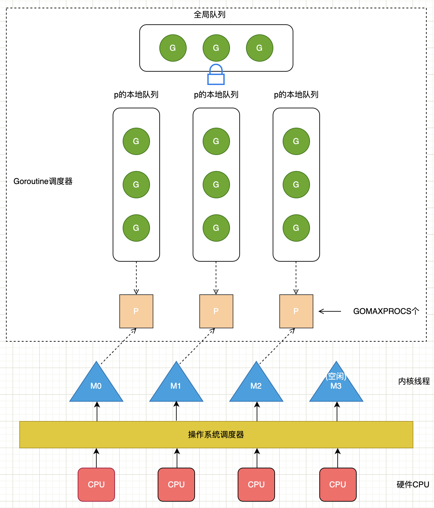

# Goroutine

## 设计原理

在接触 `goroutine` 之前，我们先来了解一下 进程、线程、协程的区别

+ 进程

进程是操作系统进行资源分配的基本单位，每个进程都有自己的独立内存空间。每个进程占据独立的内存，所以上下文进程间的切换开销（栈、寄存器、虚拟内存、文件句柄等）比较大。

+ 线程

线程又叫做轻量级进程，是进程的一个实体，是处理器任务调度和执行的基本单位。线程只拥有一点在运行中必不可少的资源(如程序计数器，一组寄存器和栈)，但是它可与同属一个进程的其他的线程共享进程所拥有的全部资源。

+ 协程

协程是一种用户态的轻量级线程，协程的调度完全由用户控制。协程拥有自己的寄存器上下文和栈。协程调度切换时，将寄存器上下文和栈保存到其他地方，在切回来的时候，恢复先前保存的寄存器上下文和栈，直接操作栈则基本没有内核切换的开销，可以不加锁的访问全局变量，所以上下文的切换非常快。

`goroutine` 是 golang 中对协程的具体实现，`goroutine` 让一组可复用的函数运行在一组线程之上，即使有协程阻塞，该线程的其他协程也可以被runtime调度，转移到其他可运行的线程上。

`goroutine` 非常轻量，一个 `goroutine` 只占几KB，并且这几KB就足够 `goroutine` 运行完，这就能在有限的内存空间内支持大量 `goroutine`，支持了更多的并发。虽然一个`goroutine` 的栈只占几KB，但实际是可伸缩的，如果需要更多内容，runtime 会自动为 `goroutine` 分配。

## GMP模型

在 Go 中，线程是运行 `goroutine` 的实体，调度器的功能是把可运行的 `goroutine` 分配到工作线程上。

### 数据结构

1. **全局队列**（Global Queue）：存放等待运行的 G。

2. **P的本地队列**：同全局队列类似，存放的也是等待运行的 G，存的数量有限，不超过256个。新建 G 时，G 优先加入到 P 的本地队列，如果队列满了，则会把本地队列中一半的 G 移动到全局队列。

3. **P列表**：所有的 P 都在程序启动时创建，并保存在数组中，最多有 GOMAXPROCS (可配置)个。

4. **M**：线程想运行任务就得获取 P，从 P 的本地队列获取 G，P 队列为空时，M 也会尝试从全局队列拿一批 G 放到 P 的本地队列，或从其他 P 的本地队列偷一半放到自己P的本地队列。M 运行 G，G 执行之后，M 会从 P 获取下一个 G，不断重复下去。

> **有关P和M的个数问题**

1. M的数量

Go 语言并发模型中的 M 是操作系统线程。调度器最多可以创建 10000 个线程，但是其中大多数的线程都不会执行用户代码（可能陷入系统调用），最多只会有 `GOMAXPROCS` 个活跃线程能够正常运行。

在默认情况下，运行时会将 `GOMAXPROCS` 设置成当前机器的核数，我们也可以在程序中使用 `runtime.GOMAXPROCS` 来改变最大的活跃线程数。

2. P的数量

因为调度器在启动时就会创建 `GOMAXPROCS` 个处理器，所以 Go 语言程序的处理器数量一定会等于 `GOMAXPROCS`，这些处理器会绑定到不同的内核线程上。

### 设计策略

复用线程：避免频繁的创建、销毁线程，而是对线程的复用。

+ work stealing机制

当本线程无可运行的 G 时，尝试从全局 G 队列偷取 G，如果全局队列没有 G 的话，再从其它线程绑定的 P 队列偷取 G。

+ hand off机制

当本线程因为 G 进行系统调用阻塞时，线程释放绑定的 P，把 P 转移给其他空闲的线程执行。
