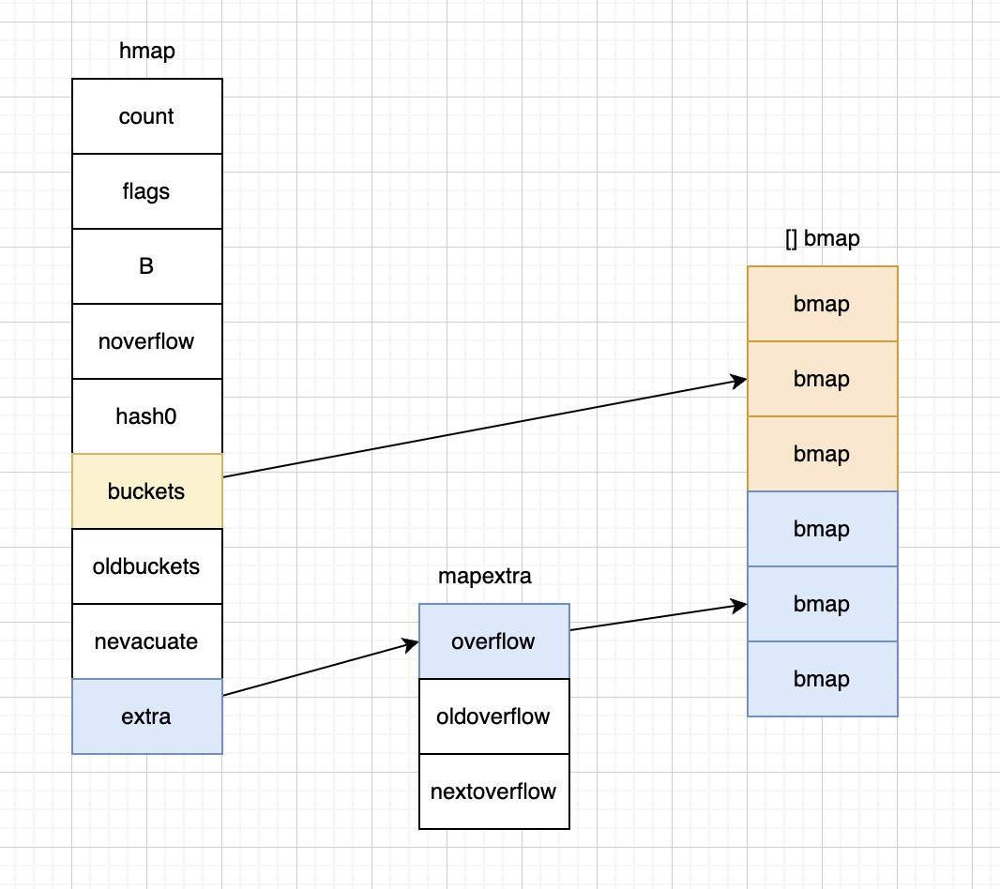

# 引用类型

引用类型：变量存储的是一个地址、这个地址对应的空间存储数据（值），内存通常在堆上分配，当没有任何变量引用这个地址时，该地址对应的数据空间就成了一个垃圾，由GC来回收

## 切片

切片 `slice` 代表变长的序列，序列中每个元素都有相同的类型。一个 `slice` 类型一般写作 []T，其中 T 代表切片中元素的类型。

### 初始化

```go
// 1. 通过下标的方式获得数组或者切片的一部分
arr[0:3] or slice[0:3]

// 2. 使用字面量初始化新的切片
slice := []int{1, 2, 3}

// 3. 使用关键字 make 创建切片。make([]T, len, cap) 元素类型、长度和容量，容量部分可以省略，在这种情况下，容量将等于长度，未省略cap >= len
slice := make([]int, 10)
```

### 数据结构

```go
type SliceHeader struct {
  Data uintptr
  Len  int
  Cap  int
}
```

+ `Data` 是指向数组的指针

+ `Len` 是当前切片的长度

+ `Cap` 是当前切片的容量，即 `Data` 数组的大小

### 切片的内存布局


```go
package main

import "fmt"

func main() {
  var intArr [5]int = [...]int{1, 2, 3, 4, 5}
  slice := intArr[0:2]
  fmt.Printf("数组地址=%p\n", &intArr)
  fmt.Printf("slice=%v len=%d cap=%d\n", slice, len(slice), cap(slice))
  fmt.Printf("数组地址=%p 切片地址=%p\n", slice, &slice)
  slice = append(slice, 6, 7)
  fmt.Printf("slice=%v len=%d cap=%d\n", slice, len(slice), cap(slice))
  fmt.Printf("数组地址=%p 切片地址=%p\n", slice, &slice)
  slice = append(slice, 8, 9)
  fmt.Printf("slice=%v len=%d cap=%d\n", slice, len(slice), cap(slice))
  fmt.Printf("数组地址=%p 切片地址=%p\n", slice, &slice)
}

$ go run main.go
数组地址=0xc000098030
slice=[1 2] len=2 cap=5
数组地址=0xc000098030 切片地址=0xc0000a2000
slice=[1 2 6 7] len=4 cap=5
数组地址=0xc000098030 切片地址=0xc0000a2000
slice=[1 2 6 7 8 9] len=6 cap=10
数组地址=0xc0000ac000 切片地址=0xc0000a2000
```

### 扩容

append内置函数可以对切片进行动态追加

```go
a := make([]int)
append(a, 5)
```

如果新元素添加到切片的长度（len）小于当前容量（cap），则不需要扩容，直接将元素添加到切片中。

如果新元素添加到切片的长度（len）等于大于当前容量（cap），则切片需要扩容。

扩容的具体策略是，将切片的容量扩大为原来的 2 倍（即 newCap = oldCap * 2），直到新容量能够容纳新元素。

如果扩容后的新容量仍然不足以容纳新元素，则重复上述过程，直到容量足够为止。

如果新容量超过了 1024，扩容的策略会变为每次增加原来容量的 25%（即 newCap = oldCap + oldCap / 4）。

扩容操作会创建一个新的底层数组，将原来的元素复制到新数组中，并返回一个新的切片。

### 切片拷贝

切片使用内置函数 `copy` 进行拷贝，copy(dst_para, src_para): dst_para 和 src_para 都是切片类型

```go
package main

import "fmt"

func main() {
  var slice1 []int = []int{1, 2, 3, 4, 5}
  var slice2 = make([]int, 10)
  var slice3 = make([]int, 1)
  copy(slice2, slice1)
  copy(slice3, slice1)
  fmt.Printf("slice1=%v\nslice2=%v\nslice3=%v\n", slice1, slice2, slice3)
}
```

```shell
slice1=[1 2 3 4 5]
slice2=[1 2 3 4 5 0 0 0 0 0]
slice3=[1]
```

## map

在 Go 语言中，一个 `map` 就是一个哈希表的引用，`map` 类型可以写为 `map[K]V`，其中 K 和 V 分别对应 key 和 value。

关于哈希表的介绍 `https://mp.weixin.qq.com/s/AkPIN6Ugno9vkQ2AAmCEAA`

`slice`、`map`、`function` 不可以作为 key，因为这几个没法用 == 来判断

### 初始化

```go
// 字面量
ages := map[string]int{
  "alice":   31,
  "charlie": 34,
}

// make
ages := make(map[string]int, 2)
ages["alice"] = 31
ages["charlie"] = 34
```

### 数据结构

```go
type hmap struct {
  count     int // # 当前哈希表中的元素数量
  flags     uint8
  B         uint8  // 当前哈希表持有的 buckets 数量
  noverflow uint16 // approximate number of overflow buckets; see incrnoverflow for details
  hash0     uint32 // hash seed

  buckets    unsafe.Pointer // array of 2^B Buckets. may be nil if count==0.
  oldbuckets unsafe.Pointer // 哈希在扩容时用于保存之前 buckets 的字段，它的大小是当前 buckets 的一半
  nevacuate  uintptr        // progress counter for evacuation (buckets less than this have been evacuated)

  extra *mapextra // optional fields
}

type mapextra struct {
  overflow    *[]*bmap
  oldoverflow *[]*bmap

  // nextOverflow holds a pointer to a free overflow bucket.
  nextOverflow *bmap
}

type bmap struct {
  tophash [bucketCnt]uint8
}
```



如上图所示哈希表 `runtime.hmap` 的桶是 `runtime.bmap`。每一个 `runtime.bmap` 都能存储 8 个键值对，当哈希表中存储的数据过多，单个桶已经装满时就会使用 `extra.nextOverflow` 中桶存储溢出的数据

上述两种不同的桶在内存中是连续存储的，我们在这里将它们分别称为正常桶和溢出桶，上图中黄色的 `runtime.bmap` 就是正常桶，绿色的 `runtime.bmap` 是溢出桶

### 增删查改

增加，更新

```go
map["key"] = value // key不存在则增加，存在则修改
```

删除

```go
delete(map, "key") // key存在则删除，key不存在也不会报错
```

查找

```go
val, ok := a["no1"] // 存在返回true, 否则false
if ok {
  fmt.Printf("key no1存在%v\n", val)
} else {
  fmt.Printf("key no1不存在\n")
}
```

### 扩容

触发扩容的因素

1. 装载因子已经超过 6.5 （装载因子 = 元素数量 / 桶数量）

2. 哈希使用了太多溢出桶

### 线程安全

`map` 在并发情况下，只读是线程安全的，同时读写是线程不安全的

需要并发安全的 `map`，可以使用 `sync.map`

## Channel

详见并发 channel 章节

`https://pddzl.github.io/blog/backend/golang/concurrence/channel.html`

## 指针

Go支持指针，但不支持指针运算，指针默认值为nil

```go
package main

import "fmt"

func main() {
  //var a *int or a := new(int)
  b := 4
  a := new(int)
  a = &b
  fmt.Printf("%v, %d\n", a, *a)
}
```

Example: 数组指针和指针数组

```go
package main

import "fmt"

func main() {
  x, y := 1, 2
  var arr = [...]int{5: 2}
  //数组指针
  var pf *[6]int = &arr

  //指针数组
  pfArr := [...]*int{&x, &y}
  fmt.Println(*pf)
  fmt.Println(*pfArr[0], *pfArr[1])
}
```

```shell
[0 0 0 0 0 2]
1 2
```

### 隐式解引用

对于一些复杂类型的指针， 如果要访问成员变量的话，需要写成类似`(*p).field`的形式，Go提供了隐式解引用特性，我们只需要`p.field`即可访问相应的成员

```go
p1 := &Person{name: "易天", age: 24}
fmt.Println((*p1).name)
fmt.Println(p1.name)
```

## 接口

Go 语言中的接口是一组方法的签名

### 隐式接口

在接口中我们只能定义方法签名，不能包含成员变量

```go
type error interface {
	Error() string
}
```

如果一个类型需要实现 error 接口，那么它只需要实现 Error() string 方法，下面的 RPCError 结构体就是 error 接口的一个实现

```go
type RPCError struct {
  Code    int64
  Message string
}

func (e *RPCError) Error() string {
  return fmt.Sprintf("%s, code=%d", e.Message, e.Code)
}
```

**Go 语言中接口的实现都是隐式的，实现接口的所有方法就隐式地实现了接口**

### 类型

1. 带有一组方法的接口

2. 不带任何方法的接口
