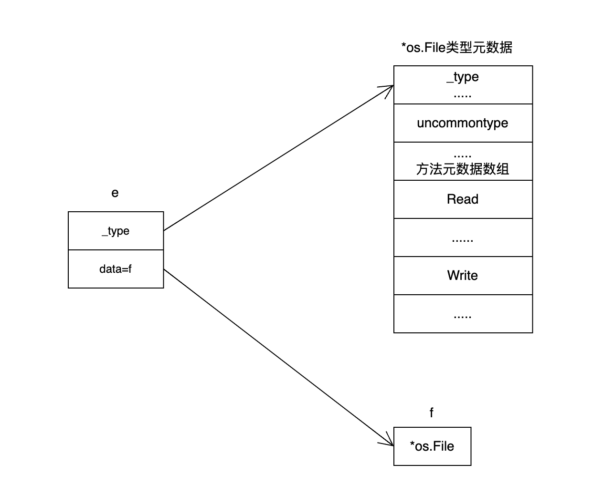
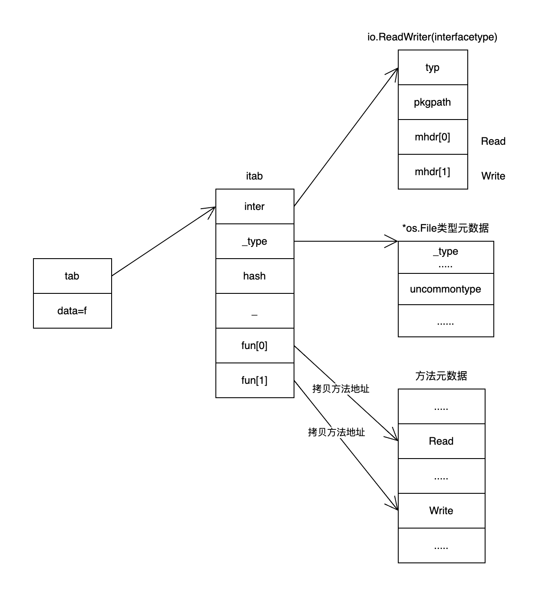

# 接口

## 概述

Go 语言中的接口是一组方法的签名，接口的实现是隐式的

```go
type mi interface {
  keep()
}

type pdd struct {
  name string
}

// pdd 实现了 mi 接口
func (p *pdd) keep() {
  fmt.Println("keep running")
}
```

### 实现方式

1. 结构体实现接口

```go
type mi interface {
  keep()
}

type pdd struct{}

func (p pdd) keep() {
  fmt.Println("keep running")
}

func main() {
  var pdd1 mi = &pdd{}
  pdd1.keep()

  var pdd2 mi = pdd{}
  pdd2.keep()
}
```

**作为指针的 `&pdd{}` 变量能够隐式地获取到指向的结构体，所以能在结构体上调用 `keep` 方法。**

2. 指针结构体实现接口

```go
type mi interface {
  keep()
}

type pdd struct{}

func (p *pdd) keep() {
  fmt.Println("keep running")
}

func main() {
  var pdd1 mi = &pdd{}
  pdd1.keep()

  // 不通过
  var pdd2 mi = pdd{}
  pdd2.keep()
}
```

```shell
./test.go:19:16: cannot use pdd{} (value of type pdd) as type mi in variable declaration:
        pdd does not implement mi (keep method has pointer receiver)
```

**在 `Go` 语言中函数传参是值拷贝， pdd2 接口拷贝了 `pdd{}`结构体，所以传入到 keep 方法里面是另一个 `pdd{}` 结构体了**

|| 结构体实现接口 | 结构体指针实现接口 |
| --- | --- | --- |
| 结构体初始化变量 | 通过 | 不通过 |
| 结构体指针初始化变量 | 通过 | 通过 |

### 系统类型运行时

runtime._type 是 Go 语言类型的运行时表示，每个类型都对应一个 runtime._type 结构体。这个结构体包含了该类型的各种信息，例如类型名称、类型大小、字段数量、方法数量、方法表等等。

```go
type _type struct {
  size       uintptr
  ptrdata    uintptr // size of memory prefix holding all pointers
  hash       uint32
  tflag      tflag
  align      uint8
  fieldAlign uint8
  kind       uint8
  // function for comparing objects of this type
  // (ptr to object A, ptr to object B) -> ==?
  equal func(unsafe.Pointer, unsafe.Pointer) bool
  // gcdata stores the GC type data for the garbage collector.
  // If the KindGCProg bit is set in kind, gcdata is a GC program.
  // Otherwise it is a ptrmask bitmap. See mbitmap.go for details.
  gcdata    *byte
  str       nameOff
  ptrToThis typeOff
}
```

### 空接口

数据结构

```go
type eface struct { // 16 字节
  _type *_type // 动态类型
  data  unsafe.Pointer // 动态值
}
```

示例

```go
var e interface{}
f, _ := os.Open("test.txt")
e = f
```



### 非空接口

数据结构

```go
type iface struct { // 16 字节
  tab  *itab
  data unsafe.Pointer
}

type itab struct {
  inter *interfacetype
  _type *_type  // 动态类型
  hash  uint32 // 类型哈希值
  _     [4]byte
  fun   [1]uintptr // 方法地址数组
}

type interfacetype struct {
  typ     _type
  pkgpath name
  mhdr    []imethod // 方法列表
}
```

示例

```go
var rw io.ReadWriter
f, _ := os.Open("test.txt")
rw = f
```



## 类型断言

接口类型转换成具体类型 `x.(T)`（判断接口类型是否实现了某个具体类型的方法）

1. 空接口.(具体类型)

```go
var a interface{}
a = 5
value, ok := a.(int)
```

对比 _type 是否为 int 类型，如果是则 ok 为 true

2. 非空接口.(具体类型)

```go
type mi interface {
  keep()
}

type pdd struct {
  name string
}

func (p *pdd) keep() {
  fmt.Println("keep running")
}

func main() {
  var pdd1 mi = &pdd{name: "pddzl"}
  p, ok := pdd1.(*pdd)
  if ok {
    fmt.Println("value =", p)
  }
}
```

3. 空接口.(非空接口)

```go
var e interface{}
rw, ok := e.(io.ReadWriter)
```

判断 e 是否实现了 io.ReadWriter 接口，如果是则 ok 为 true

```go
var e interface{}
f, _ := os.Open("test.txt") // func Open(name string) (*File, error)
e = f // f 为 *os.File 指针结构体
rw, ok := e.(io.ReadWriter)
```

判断 *os.File 是否实现了 io.ReadWriter 接口，如果是则 ok 为 true

4. 非空接口.(非空接口)

```go
var w io.Writer
f, _ := os.Open("test.txt")
w = f
rw, ok := w.(io.ReadWriter)
```

先判断 *os.File 是否实现了 io.Writer 接口，再判断是否实现了 io.ReadWriter 接口

## 动态派发

在运行时，根据接口变量实际存储的类型信息来动态调用该类型的方法

```go
type mi interface {
  keep()
}

type pdd struct{}

func (p *pdd) keep() {
  fmt.Println("keep running")
}

func main() {
  var pdd1 mi = &pdd{}
  pdd1.keep()
}
```
