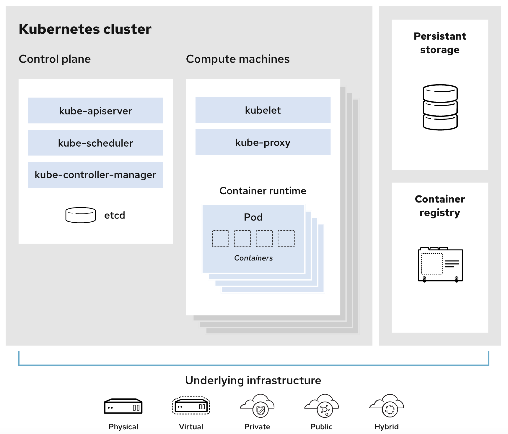

## K8s 组件

架构图



### 控制平面组件

**kube-apiserver**

`Kubernetes API`是 Kubernetes 控制平面的前端，用于处理内部和外部请求。API 服务器会确定请求是否有效，如果有效，则对其进行处理。您可以通过 REST 调用、kubectl 命令行界面或其他命令行工具（例如 kubeadm）来访问 API。

**kube-scheduler**

控制平面组件，负责监视新创建的、未指定运行节点（node）的 Pods，选择节点让 Pod 在上面运行。调度决策考虑的因素包括单个 Pod 和 Pod 集合的资源需求、硬件/软件/策略约束、亲和性和反亲和性规范、数据位置、工作负载间的干扰和最后时限。

**kube-controller-manager**

运行控制器进程的控制平面组件

+ 节点控制器（Node Controller）：负责在节点出现故障时进行通知和响应

+ 任务控制器（Job controller）：监测代表一次性任务的 Job 对象，然后创建 Pods 来运行这些任务直至完成

+ 端点控制器（Endpoints Controller）：填充端点（Endpoints）对象（即加入 Service 与 Pod）

+ 服务帐户和令牌控制器（Service Account & Token Controllers）：为新的命名空间创建默认帐户和 API 访问令牌

**etcd**

etcd 是兼具一致性和高可用性的键值数据库，可以作为保存 Kubernetes 所有集群数据的后台数据库。

### 节点组件

**kubelet**

一个在集群中每个节点（node）上运行的代理。 它保证容器（containers）都 运行在 Pod 中。

**kube-proxy**

kube-proxy 是集群中每个节点上运行的网络代理， 实现 Kubernetes 服务（Service） 概念的一部分。kube-proxy 维护节点上的网络规则。这些网络规则允许从集群内部或外部的网络会话与 Pod 进行网络通信。如果操作系统提供了数据包过滤层并可用的话，kube-proxy 会通过它来实现网络规则。否则， kube-proxy 仅转发流量本身。

**容器运行时（Container Runtime）**

容器运行环境是负责运行容器的软件。Kubernetes 支持容器运行时，例如 Docker、 containerd、CRI-O 以及 [Kubernetes CRI (容器运行环境接口)](https://github.com/kubernetes/community/blob/master/contributors/devel/sig-node/container-runtime-interface.md) 的其他任何实现。

## K8s API

查看所有api组

```shell
[root@node1 ~]# kubectl get --raw /
```

通过api查看namespace test

```shell
[root@node1 ~]# kubectl get --raw '/api/v1/namespaces/test'
{"kind":"Namespace","apiVersion":"v1","metadata":{"name":"test","uid":"11b94940-21e2-44f6-a5fb-923788045c86","resourceVersion":"8614265","creationTimestamp":"2022-03-31T13:15:16Z","labels":{"kubernetes.io/metadata.name":"test"},"managedFields":[{"manager":"kubectl-create","operation":"Update","apiVersion":"v1","time":"2022-03-31T13:15:16Z","fieldsType":"FieldsV1","fieldsV1":{"f:metadata":{"f:labels":{".":{},"f:kubernetes.io/metadata.name":{}}}}}]},"spec":{"finalizers":["kubernetes"]},"status":{"phase":"Active"}}
```

## K8s 对象

在 Kubernetes 系统中，Kubernetes 对象是持久化的实体。 Kubernetes 使用这些实体去表示整个集群的状态。

几乎每个 Kubernetes 对象包含两个嵌套的对象字段，它们负责管理对象的配置： `spec`（规约）和 `status`（状态）

`spec` 你必须在创建对象时设置其内容，描述你希望对象所具有的特征： 期望状态（Desired State）

`status` 描述了对象的当前状态（Current State），它是由 Kubernetes 系统和组件设置并更新的

```yaml
apiVersion: apps/v1
kind: Deployment
metadata:
  name: nginx-deployment
spec:
  selector:
    matchLabels:
      app: nginx
  replicas: 2 # tells deployment to run 2 pods matching the template
  template:
    metadata:
      labels:
        app: nginx
    spec:
      containers:
      - name: nginx
        image: nginx:1.14.2
        ports:
        - containerPort: 80
```

**必需字段**

- `apiVersion` 创建该对象所使用的 Kubernetes API 的版本

- `kind` 想要创建的对象的类别

- `metadata` 唯一性标识对象的一些数据，包括一个 name 字符串、UID 和可选的 namespace

- `spec` 你所期望的该对象的状态

**查看所有api版本**

```shell
[root@node1 ~]# kubectl api-versions
admissionregistration.k8s.io/v1
apiextensions.k8s.io/v1
apiregistration.k8s.io/v1
apps/v1
authentication.k8s.io/v1
authorization.k8s.io/v1
autoscaling/v1
autoscaling/v2
autoscaling/v2beta1
autoscaling/v2beta2
batch/v1
batch/v1beta1
certificates.k8s.io/v1
coordination.k8s.io/v1
discovery.k8s.io/v1
discovery.k8s.io/v1beta1
events.k8s.io/v1
events.k8s.io/v1beta1
flowcontrol.apiserver.k8s.io/v1beta1
flowcontrol.apiserver.k8s.io/v1beta2
networking.k8s.io/v1
node.k8s.io/v1
node.k8s.io/v1beta1
policy/v1
policy/v1beta1
rbac.authorization.k8s.io/v1
scheduling.k8s.io/v1
storage.k8s.io/v1
storage.k8s.io/v1beta1
v1
```

**查看所有api资源**

```shell
[root@node1 ~]# kubectl api-resources
NAME                              SHORTNAMES   APIVERSION                             NAMESPACED   KIND
bindings                                       v1                                     true         Binding
componentstatuses                 cs           v1                                     false        ComponentStatus
configmaps                        cm           v1                                     true         ConfigMap
endpoints                         ep           v1                                     true         Endpoints
events                            ev           v1                                     true         Event
limitranges                       limits       v1                                     true         LimitRange
namespaces                        ns           v1                                     false        Namespace
nodes                             no           v1                                     false        Node
persistentvolumeclaims            pvc          v1                                     true         PersistentVolumeClaim
persistentvolumes                 pv           v1                                     false        PersistentVolume
pods                              po           v1                                     true         Pod
podtemplates                                   v1                                     true         PodTemplate
replicationcontrollers            rc           v1                                     true         ReplicationController
resourcequotas                    quota        v1                                     true         ResourceQuota
secrets                                        v1                                     true         Secret
serviceaccounts                   sa           v1                                     true         ServiceAccount
services                          svc          v1                                     true         Service
mutatingwebhookconfigurations                  admissionregistration.k8s.io/v1        false        MutatingWebhookConfiguration
validatingwebhookconfigurations                admissionregistration.k8s.io/v1        false        ValidatingWebhookConfiguration
customresourcedefinitions         crd,crds     apiextensions.k8s.io/v1                false        CustomResourceDefinition
apiservices                                    apiregistration.k8s.io/v1              false        APIService
controllerrevisions                            apps/v1                                true         ControllerRevision
daemonsets                        ds           apps/v1                                true         DaemonSet
deployments                       deploy       apps/v1                                true         Deployment
replicasets                       rs           apps/v1                                true         ReplicaSet
statefulsets                      sts          apps/v1                                true         StatefulSet
tokenreviews                                   authentication.k8s.io/v1               false        TokenReview
localsubjectaccessreviews                      authorization.k8s.io/v1                true         LocalSubjectAccessReview
selfsubjectaccessreviews                       authorization.k8s.io/v1                false        SelfSubjectAccessReview
selfsubjectrulesreviews                        authorization.k8s.io/v1                false        SelfSubjectRulesReview
subjectaccessreviews                           authorization.k8s.io/v1                false        SubjectAccessReview
horizontalpodautoscalers          hpa          autoscaling/v2                         true         HorizontalPodAutoscaler
cronjobs                          cj           batch/v1                               true         CronJob
jobs                                           batch/v1                               true         Job
certificatesigningrequests        csr          certificates.k8s.io/v1                 false        CertificateSigningRequest
leases                                         coordination.k8s.io/v1                 true         Lease
endpointslices                                 discovery.k8s.io/v1                    true         EndpointSlice
events                            ev           events.k8s.io/v1                       true         Event
flowschemas                                    flowcontrol.apiserver.k8s.io/v1beta2   false        FlowSchema
prioritylevelconfigurations                    flowcontrol.apiserver.k8s.io/v1beta2   false        PriorityLevelConfiguration
ingressclasses                                 networking.k8s.io/v1                   false        IngressClass
ingresses                         ing          networking.k8s.io/v1                   true         Ingress
networkpolicies                   netpol       networking.k8s.io/v1                   true         NetworkPolicy
runtimeclasses                                 node.k8s.io/v1                         false        RuntimeClass
poddisruptionbudgets              pdb          policy/v1                              true         PodDisruptionBudget
podsecuritypolicies               psp          policy/v1beta1                         false        PodSecurityPolicy
clusterrolebindings                            rbac.authorization.k8s.io/v1           false        ClusterRoleBinding
clusterroles                                   rbac.authorization.k8s.io/v1           false        ClusterRole
rolebindings                                   rbac.authorization.k8s.io/v1           true         RoleBinding
roles                                          rbac.authorization.k8s.io/v1           true         Role
priorityclasses                   pc           scheduling.k8s.io/v1                   false        PriorityClass
csidrivers                                     storage.k8s.io/v1                      false        CSIDriver
csinodes                                       storage.k8s.io/v1                      false        CSINode
csistoragecapacities                           storage.k8s.io/v1beta1                 true         CSIStorageCapacity
storageclasses                    sc           storage.k8s.io/v1                      false        StorageClass
volumeattachments                              storage.k8s.io/v1                      false        VolumeAttachment
```

**查看资源对象拥有的字段**

`kubectl explain <资源对象名>`

```shell
[root@node1 ~]# kubectl explain pod
KIND:     Pod
VERSION:  v1

DESCRIPTION:
     Pod is a collection of containers that can run on a host. This resource is
     created by clients and scheduled onto hosts.

FIELDS:
   apiVersion	<string>
     APIVersion defines the versioned schema of this representation of an
     object. Servers should convert recognized schemas to the latest internal
     value, and may reject unrecognized values. More info:
     https://git.k8s.io/community/contributors/devel/sig-architecture/api-conventions.md#resources

   kind	<string>
     Kind is a string value representing the REST resource this object
     represents. Servers may infer this from the endpoint the client submits
     requests to. Cannot be updated. In CamelCase. More info:
     https://git.k8s.io/community/contributors/devel/sig-architecture/api-conventions.md#types-kinds

   metadata	<Object>
     Standard object's metadata. More info:
     https://git.k8s.io/community/contributors/devel/sig-architecture/api-conventions.md#metadata

   spec	<Object>
     Specification of the desired behavior of the pod. More info:
     https://git.k8s.io/community/contributors/devel/sig-architecture/api-conventions.md#spec-and-status

   status	<Object>
     Most recently observed status of the pod. This data may not be up to date.
     Populated by the system. Read-only. More info:
     https://git.k8s.io/community/contributors/devel/sig-architecture/api-conventions.md#spec-and-status

```

以上命令只会列出一级字段，一级字段可能还包含二级字段、三级字段。如果想列出所有字段，可以加上`--recursive`

`kubectl explain pod --recursive`

查看具体字段

`kubectl explain pod.kind`

**查看已存在资源的详情**

```shell
[root@node1 ~]# kubectl get ns kubeops -o yaml
apiVersion: v1
kind: Namespace
metadata:
  creationTimestamp: "2022-02-22T09:07:23Z"
  labels:
    kubernetes.io/metadata.name: kubeops
  name: kubeops
  resourceVersion: "4121364"
  uid: 4a38aee3-eb89-454b-a981-e731c3e8aadc
spec:
  finalizers:
  - kubernetes
status:
  phase: Active
```

使用 `raw` 方式查看

`kubectl get --raw '/api/v1/namespaces/kubeops'`

```json
{"kind":"Namespace","apiVersion":"v1","metadata":{"name":"kubeops","uid":"4a38aee3-eb89-454b-a981-e731c3e8aadc","resourceVersion":"4121364","creationTimestamp":"2022-02-22T09:07:23Z","labels":{"kubernetes.io/metadata.name":"kubeops"},"managedFields":[{"manager":"kubectl-create","operation":"Update","apiVersion":"v1","time":"2022-02-22T09:07:23Z","fieldsType":"FieldsV1","fieldsV1":{"f:metadata":{"f:labels":{".":{},"f:kubernetes.io/metadata.name":{}}}}}]},"spec":{"finalizers":["kubernetes"]},"status":{"phase":"Active"}}
```
