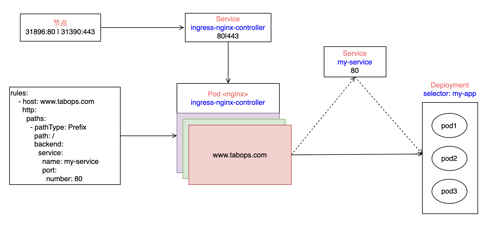

# Ingress

## 介绍

Ingress 是 Kubernetes 中的一种资源对象，用于定义对集群内部的服务的访问规则。它充当着一个入口点，将外部的流量路由到集群内部的服务



## 安装

下载编排文件

```shell
wget https://raw.githubusercontent.com/kubernetes/ingress-nginx/controller-v1.8.0/deploy/static/provider/cloud/deploy.yaml
```

修改 service 部署方式为 NodePort

```yaml
apiVersion: v1
kind: Service
  type: NodePort
```

部署 [修改镜像地址为国内能访问到的地址]

```shell
kubectl apply -f deploy.yaml
```

```shell
[root@node1 ingress]# kubectl get pods -n ingress-nginx
NAME                                        READY   STATUS      RESTARTS   AGE
ingress-nginx-admission-create-l2w4z        0/1     Completed   0          4d13h
ingress-nginx-admission-patch-4tj67         0/1     Completed   0          4d13h
ingress-nginx-controller-7bc846c994-s6qvr   1/1     Running     0          4d13h
```

`ingress-nginx-admission-create` 监听 k8s api 当集群有新创建的 ingress 时，在 ingress-nginx-controller 的 nginx.conf 中添加对应的规则

`ingress-nginx-admission-patch` 监听 k8s api 当集群中已存在的 ingress 配置发生修改时，在 ingress-nginx-controller 的 nginx.conf 中修改对应的规则

`ingress-nginx-controller` nginx pod 负责反向代理和负载均衡

查看服务

```shell
[root@node1 ~]# kubectl get svc -n ingress-nginx
NAME                                 TYPE        CLUSTER-IP       EXTERNAL-IP   PORT(S)                      AGE
ingress-nginx-controller             NodePort    10.103.230.2     <none>        80:31896/TCP,443:31390/TCP   4d13h
ingress-nginx-controller-admission   ClusterIP   10.108.235.143   <none>        443/TCP                      4d13h
```

```shell
(base) ➜  ~ curl http://10.192.104.103:31896/
<html>
<head><title>404 Not Found</title></head>
<body>
<center><h1>404 Not Found</h1></center>
<hr><center>nginx</center>
</body>
</html>
```

部署后端服务

```yaml
apiVersion: apps/v1
kind: Deployment
metadata:
  name: my-deployment
  namespace: test
spec:
  replicas: 2
  selector:
    matchLabels:
      app: my-app
  template:
    metadata:
      labels:
        app: my-app
    spec:
      containers:
        - name: my-container
          image: docker.io/library/myhttp:v1
          ports:
            - containerPort: 9090
---
apiVersion: v1
kind: Service
metadata:
  name: my-service
  namespace: test
spec:
  selector:
    app: my-app
  ports:
    - protocol: TCP
      port: 80
      targetPort: 9090
  type: ClusterIP
```

```shell
kubectl apply -f backend.yaml
```

ingess 关联后端服务

```yaml
apiVersion: networking.k8s.io/v1
kind: Ingress
metadata:
  name: my-ingress
  namespace: test
  annotations:
    kubernetes.io/ingress.class: "nginx"
spec:
  rules:
    - host: www.tabops.com
      http:
        paths:
          - pathType: Prefix
            path: /
            backend:
              service:
                name: my-service
                port:
                  number: 80
```

```shell
[root@node1 test]# kubectl get ingress -n test
NAME         CLASS    HOSTS            ADDRESS   PORTS   AGE
my-ingress   <none>   www.tabops.com             80      46s
[root@node1 test]# kubectl describe ingress -n test
Name:             my-ingress
Labels:           <none>
Namespace:        test
Address:
Ingress Class:    <none>
Default backend:  <default>
Rules:
  Host            Path  Backends
  ----            ----  --------
  www.tabops.com
                  /   my-service:80 (10.88.0.24:9090,10.88.0.33:9090)
Annotations:      kubernetes.io/ingress.class: nginx
Events:
  Type    Reason  Age   From                      Message
  ----    ------  ----  ----                      -------
  Normal  Sync    57s   nginx-ingress-controller  Scheduled for sync
```

修改主机hosts

```shell
# /etc/hosts 添加条目
10.192.104.103 www.tabops.com
````

```shell
(base) ➜  ~ curl 'http://www.tabops.com:31896/'
my-deployment-554bd5796f-t8wz4
```

## 参考

`https://www.cnblogs.com/linuxk/p/9706720.html`