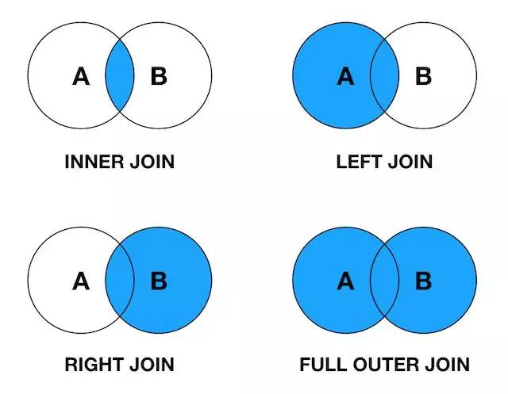

# JOIN

## 前提准备

创建用户表、角色表做测试

```sql
CREATE TABLE `sys_user` (
  `id` bigint unsigned NOT NULL AUTO_INCREMENT,
  `username` varchar(191) COLLATE utf8mb4_unicode_ci NOT NULL COMMENT '用户名',
  `password` varchar(191) COLLATE utf8mb4_unicode_ci NOT NULL COMMENT '密码',
  `role_id` bigint unsigned DEFAULT NULL COMMENT '角色Id',
  PRIMARY KEY (`id`),
  UNIQUE KEY `username` (`username`)
) ENGINE=InnoDB DEFAULT CHARSET=utf8mb4 COLLATE=utf8mb4_unicode_ci;
```

| id | username | password | role_id |
| -- | --- | --- | --- |
| 1 | pdd | 123456 | 1 |
| 2 | pxx | 123456 | 2 |
| 3 | ptt | 123456 | NULL |

```sql
CREATE TABLE `sys_role` (
  `id` bigint unsigned NOT NULL AUTO_INCREMENT,
  `role_name` varchar(191) COLLATE utf8mb4_unicode_ci NOT NULL COMMENT '角色名称',
  PRIMARY KEY (`id`)
) ENGINE=InnoDB DEFAULT CHARSET=utf8mb4 COLLATE=utf8mb4_unicode_ci;
```

| id | role_name |
| -- | -- |
| 1 | admin |
| 2 | editor |
| 3 | guest |

### 概念图



## 左连接

`left join` 返回包括左表中的所有记录和右表中连接字段相等的记录

```shell
mysql> select * from sys_user d1 left join sys_role d2 on d1.role_id = d2.id;
+----+----------+----------+---------+------+-----------+
| id | username | password | role_id | id   | role_name |
+----+----------+----------+---------+------+-----------+
|  1 | pdd      | 123456   |       1 |    1 | admin     |
|  2 | pxx      | 123456   |       2 |    2 | editor    |
|  3 | ptt      | 123456   |    NULL | NULL | NULL      |
+----+----------+----------+---------+------+-----------+
3 rows in set (0.00 sec)
```

## 右连接

`right join` 返回包括右表中的所有记录和左表中连接字段相等的记录

```shell
mysql> select * from sys_user d1 right join sys_role d2 on d1.role_id = d2.id;
+------+----------+----------+---------+----+-----------+
| id   | username | password | role_id | id | role_name |
+------+----------+----------+---------+----+-----------+
|    1 | pdd      | 123456   |       1 |  1 | admin     |
|    2 | pxx      | 123456   |       2 |  2 | editor    |
| NULL | NULL     | NULL     |    NULL |  3 | guest     |
+------+----------+----------+---------+----+-----------+
3 rows in set (0.00 sec)
```

## 内连接

`inner join` 只返回两个表中连接字段相等的行

```shell
mysql> select * from sys_user d1 inner join sys_role d2 on d1.role_id = d2.id;
+----+----------+----------+---------+----+-----------+
| id | username | password | role_id | id | role_name |
+----+----------+----------+---------+----+-----------+
|  1 | pdd      | 123456   |       1 |  1 | admin     |
|  2 | pxx      | 123456   |       2 |  2 | editor    |
+----+----------+----------+---------+----+-----------+
2 rows in set (0.00 sec)
```

## 全外连接

`full join` 返回左右表中所有的记录和左右表中连接字段相等的记录

`MySQL` 不支持 `full outer join` 语法，需要用 `union all` 来模拟

```shell
mysql> select * from sys_user d1 left join sys_role d2 on d1.role_id = d2.id union all select * from sys_user d1 right join sys_role d2 on d1.role_id = d2.id where d1.id is null;
+------+----------+----------+---------+------+-----------+
| id   | username | password | role_id | id   | role_name |
+------+----------+----------+---------+------+-----------+
|    1 | pdd      | 123456   |       1 |    1 | admin     |
|    2 | pxx      | 123456   |       2 |    2 | editor    |
|    3 | ptt      | 123456   |    NULL | NULL | NULL      |
| NULL | NULL     | NULL     |    NULL |    3 | guest     |
+------+----------+----------+---------+------+-----------+
4 rows in set (0.00 sec)
```
