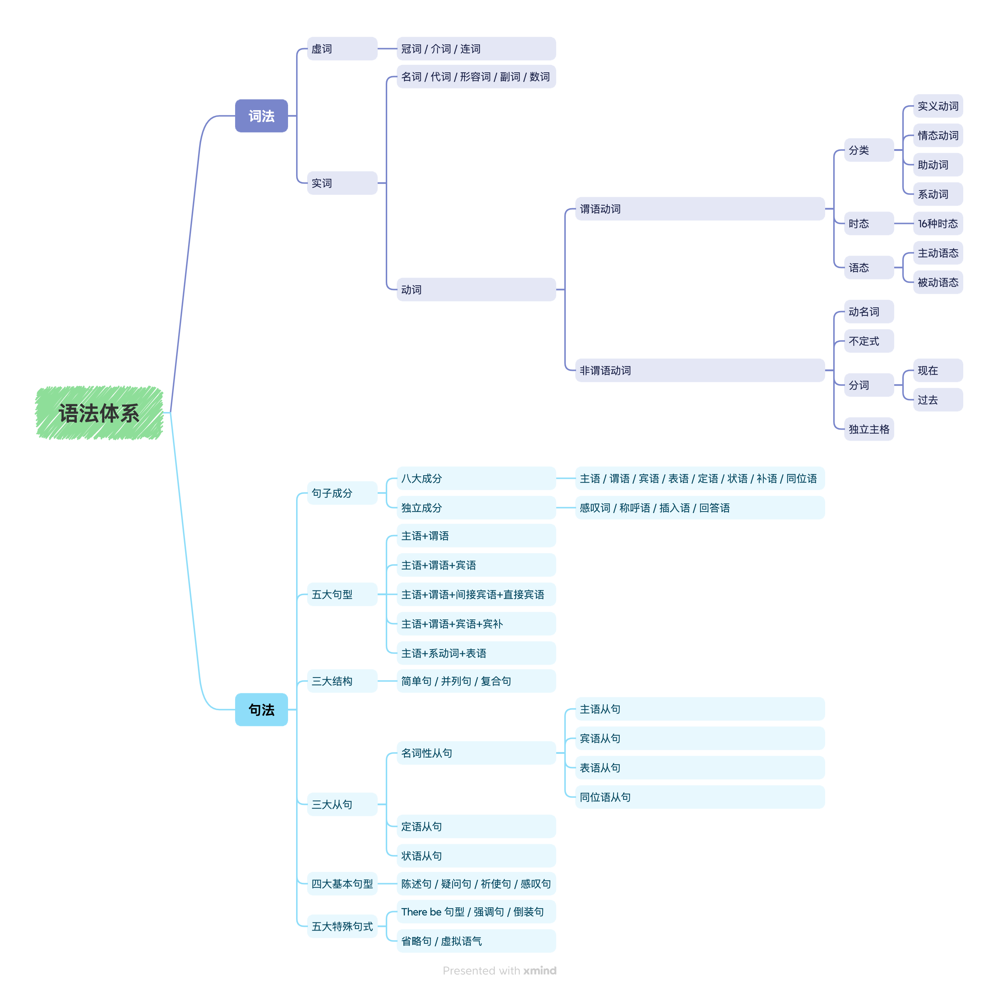

# 语法

## 名词

1. 如果名词是以 s 结尾的，变成复数时要加es，如 dress -- dresses。

2. 表示复数的 -s 或 -es 一般遵循以下发音规则:

  (1) 如果名词词尾的发音是一个清辅音（/s/,/J/,/t∫/ 除外），-s发/s/ 的音，如 books /buks/，suits /su:ts/

  (2) 如果名词词尾的发音是一个浊辅音（/z/,/3/,/d3/ 除外）或元音，-s 发/z/ 的音，如 ties /tarz/，dogs /dpgz/

  (3) 如果名词词尾的发音是 /s/，/z/，/J/，/3/，/t∫/ 或 /d3/，-es 发 /IZ/ 的音，如 dresses /'dresIz/，blouses /'blauzrz/

3. 如果名词是以 f 或 fe 结尾的，变成复数时，一般要把 f 或 fe 变成 v，再加 es，如 housewife -- housewives

4. 英语中有一些名词的复数形式是不规则的，如 man，woman，以及由这两个词组成的复合名词:

  man--men; woman--women

  milkman -- milkmen

  policewoman -- policewomen

## 定语

### 前置定语

### 后置定语

A "gift" to pull a "snow" job on your kids and freeze them in place like an "icicle"

to pull...豆包说这个是后置定语，ChatGPT说不是 是不定式短语
