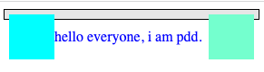
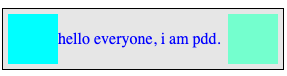
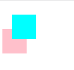
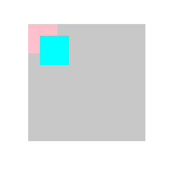
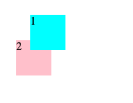
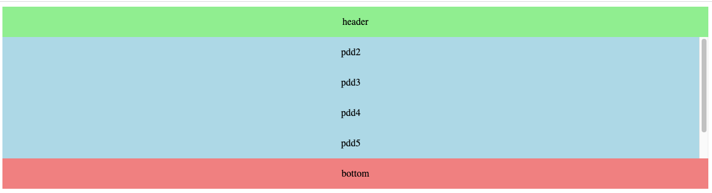
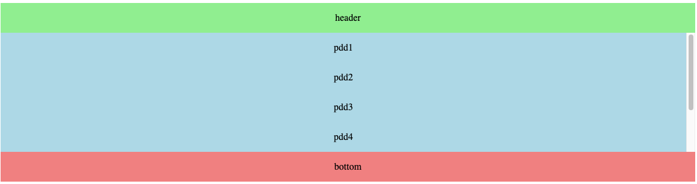

# 布局

## float

`float` CSS属性指定一个元素应沿其容器的左侧或右侧放置，允许**文本**和**内联元素**环绕它。该元素从网页的正常流动(文档流)中移除，尽管仍然保持部分的流动性（与绝对定位相反）

### 语法

`float: left` 表明元素必须浮动在其所在的块容器左侧的关键字

`float: right` 表明元素必须浮动在其所在的块容器右侧的关键字

### 清除浮动

在非IE浏览器（如Firefox）下，当容器的高度为auto，且容器的内容中有浮动（float为left或right）的元素，在这种情况下，容器的高度不能自动伸长以适应内容的高度，使得内容溢出到容器外面而影响（甚至破坏）布局的现象。这个现象叫浮动溢出，为了防止这个现象的出现而进行的CSS处理，就叫CSS清除浮动。

```html
<!DOCTYPE html>
<html lang="en">

<head>
  <meta charset="UTF-8">
  <meta http-equiv="X-UA-Compatible" content="IE=edge">
  <meta name="viewport" content="width=device-width, initial-scale=1.0">
  <title>Document</title>
  <style type="text/css">
    .test {
      background-color: rgba(128, 128, 128, 0.185);
      border: solid 1px black;
      width: 270px;
      padding: 5px;
    }

    p {
      color: blue;
      float: left;
    }

    .left {
      width: 50px;
      height: 50px;
      background-color: aqua;
      float: left;
    }

    .right {
      width: 50px;
      height: 50px;
      background-color: aquamarine;
      float: right;
    }

    /* .clearfix:after {
      content: "020";
      display: block;
      height: 0;
      clear: both;
      visibility: hidden;
    } */
  </style>
</head>

<body>
  <div class="test clearfix">
    <div class="left"></div>
    <p>
      hello everyone, i am pdd.
    </p>
    <div class="right"></div>
  </div>
</body>

</html>
```



清除浮动，不注释`.clearfix:after`



参考：`https://segmentfault.com/a/1190000004865198`

## position

`position` 属性用于指定一个元素在文档中的定位方式，一共有5种定位方式

- static

`static` 是 `position` 属性的默认值。

这时，浏览器会按照源码的顺序，决定每个元素的位置，这称为"正常的页面流"（normal flow）。每个块级元素占据自己的区块（block），元素与元素之间不产生重叠，这个位置就是元素的默认位置。（top、buttom、left、right属性失效）

- relative

相对定位，`relative` 是相对于**自身默认位置**进行偏移，元素不会被移出正常文档流

example: block1向右向下偏移20px

```html
<html>
  <head>
    <style>
      .block1 {
        width: 50px;
        height: 50px;
        background-color: aqua;
        position: relative;
        left: 20px;
        top: 20px;
      }
      .block2 {
        width: 50px;
        height: 50px;
        background-color: pink;
      }
    </style>
  </head>
  <body>
    <div class="block1">
      <p>block1</p>
    </div>
    <div class="block2">
      <p>block2</p>
    </div>
  </body>
</html>
```



- absolute

绝对定位，`absolute` 相对于父级元素进行偏移（最近父一级的非 `static` 定位元素，如果未找到定位元素，则定位基点就会变成整个网页的根元素 `html`），元素会被移出正常文档流



- fixed

固定定位，`fixed` 相对于视口（viewport，浏览器窗口）进行偏移，即定位基点是浏览器窗口。这会导致元素的位置不随页面滚动而变化，好像固定在网页上一样。元素会被移出正常文档流。

- sticky

`sticky` 跟前面四个属性值都不一样，它会产生动态效果，很像 `relative` 和 `fixed` 的结合：一些时候是 `relative` 定位（定位基点是自身默认位置），另一些时候自动变成`fixed`定位（定位基点是视口）。元素不会被移出正常文档流

### z-index

`z-index` 属性设定了一个定位元素及其后代元素或 `flex` 项目的 `z-order`。当元素之间重叠的时候，`z-index` 较大的元素会覆盖较小的元素在上层进行显示。(默认是后面的元素覆盖前面的元素)

```html
<html>
  <head>
    <style>
      .block1 {
        width: 50px;
        height: 50px;
        background-color: aqua;
        position: relative;
        left: 20px;
        top: 20px;
        z-index: 2;
      }
      .block2 {
        width: 50px;
        height: 50px;
        background-color: pink;
        position: relative;
        z-index: 1;
      }
    </style>
  </head>
  <body>
    <div class="block1">
      <p>1</p>
    </div>
    <div class="block2">
      <p>2</p>
    </div>
  </body>
</html>
```



#### 定位实现水平垂直居中

```html
position: relative;
left: 50%;
top: 50%;
transform: trnaslate(-%50, -%50);
```

## flex

`Example:`

1. 设置垂直居中 `align-item: center` 和 `overflow-y: auto` 内容溢出后顶部内部看不到

```html
<!DOCTYPE html>
<html lang="en">

<head>
  <style type="text/css">
    .container {
      display: flex;
      justify-content: center;
      align-items: center;
      flex-direction: column;
      height: 300px;
    }
    .header {
      background-color: lightgreen;
      width: 100%;
    }
    .content {
      flex-grow: 1;
      display: flex;
      justify-content: center;
      align-items: center;
      flex-direction: column;
      background-color: lightblue;
      overflow-y: auto;
      width: 100%;
    }
    .bottom {
      display: flex;
      justify-content: center;
      align-items: center;
      flex-basis: 20%;
      background-color: lightcoral;
      width: 100%;
    }
  </style>
</head>

<body>
  <div class="container">
    <div class="header">
      <p style="text-align: center;">header</p>
    </div>
    <div class="content">
      <p>pdd1</p>
      <p>pdd2</p>
      <p>pdd3</p>
      <p>pdd4</p>
      <p>pdd5</p>
      <p>pdd6</p>
    </div>
    <div class="bottom">
      <p>bottom</p>
    </div>
  </div>
</body>

</html>
```



::: warning
pdd1 未能显示出来
:::

解决方案: 嵌套一个div

```html
<!DOCTYPE html>
<html lang="en">

<head>
  <style type="text/css">
    .container {
      display: flex;
      justify-content: center;
      align-items: center;
      flex-direction: column;
      height: 300px;
    }
    .header {
      background-color: lightgreen;
      width: 100%;
    }
    .scroll-content {
      margin-top: auto;
      margin-bottom: auto;
      overflow-y: auto;
      width: 100%;
    }
    .content {
      flex-grow: 1;
      display: flex;
      justify-content: center;
      align-items: center;
      flex-direction: column;
      background-color: lightblue;
    }
    .bottom {
      display: flex;
      justify-content: center;
      align-items: center;
      flex-basis: 20%;
      background-color: lightcoral;
      width: 100%;
    }
  </style>
</head>

<body>
  <div class="container">
    <div class="header">
      <p style="text-align: center;">header</p>
    </div>
    <div class="scroll-content">
      <div class="content">
        <p>pdd1</p>
        <p>pdd2</p>
        <p>pdd3</p>
        <p>pdd4</p>
        <p>pdd5</p>
        <p>pdd6</p>
      </div>
    </div>
    <div class="bottom">
      <p>bottom</p>
    </div>
  </div>
</body>

</html>
```



## grid
