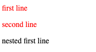

# 选择器

## 基本选择器

- 通用选择器

`*` 选择所有元素

语法：`*` `ns|*` `*|*`

例子：

```css
* {
  backgroud-color: purple;
}
```

- 元素选择器

按照给定的节点名称，选择所有匹配的元素

语法：`element name`

例子：

```css
p {
  font-size: 12px;
}
```

- 类选择器

按照给定的类属性的值，选择所有匹配的元素

语法：`.class name`

例子：

```css
.bottom {
  margin-bottom: 10px;
}
```

- ID选择器

按照 id 属性选择一个与之匹配的元素。需要注意的是，**一个文档中，每个 ID 属性都应当是唯一的**

语法：`#id name`

例子：

```css
#pdd {
  padding: 10px;
}
```

- 属性选择器

按照给定的属性，选择所有匹配的元素

语法：`[attr]` `[attr=value]` `[attr~=value]` `[attr|=value]` `[attr^=value]` `[attr$=value]` `[attr*=value]`

例子：

```css
[title]
{
  color:blue;
}
```

## 分组选择器

- 选择器列表

`,` 是将不同的选择器组合在一起的方法，它选择所有能被列表中的任意一个选择器选中的节点

语法：`A, B`

例子：`div, span` 会同时匹配 `<span>` 元素和 `<div>` 元素

### 组合器

- 后代组合器

（空格）组合器选择前一个元素的后代节点。

语法：A B

例子：`div span` 匹配所有位于任意 `<div>` 元素之内的 `<span>` 元素。

- 直接子代组合器

`>` 组合器选择前一个元素的直接子代的节点。

语法：`A > B`

例子：

```html
<html>
  <head>
    <style type="text/css">
      .test >p {
        color: red;
      }
    </style>
  </head>
  <body>
    <div class="test">
      <p>first line</p>
      <p>second line</p>
      <div>
        <p>nested first line</p>
      </div>
    </div>
  </body>
</html>
```



- 一般兄弟组合器

`~` 组合器选择兄弟元素，也就是说，后一个节点在前一个节点后面的任意位置，并且共享同一个父节点。

语法：`A ~ B`

例子：`p ~ span` 匹配同一父元素下，`<p>` 元素后的所有 `<span>` 元素。

- 紧邻兄弟组合器

`+` 组合器选择相邻元素，即后一个元素紧跟在前一个之后，并且共享同一个父节点。

语法：`A + B`

例子：`h2 + p` 会匹配所有紧邻在 `<h2>` 元素后的 `<p>` 元素。

- 列组合器

`||` 组合器选择属于某个表格行的节点。

语法： `A || B`

例子： `col || td` 会匹配所有 `<col>` 作用域内的 `<td>` 元素。

## 伪选择器

- 伪类

`:` 伪选择器支持按照未被包含在文档树中的状态信息来选择元素

| 选择器 | 描述 | 备注 |
| ----- | --- | ---- |
| :first-child | 匹配兄弟元素中的第一个元素 | 所选元素前面不能有兄弟节点 |
| :last-child | 匹配兄弟元素中最末的那个元素 | 所选元素后面不能有兄弟节点 |
| :not | 匹配作为值传入自身的选择器未匹配的物件 | |
| :nth-child | 匹配一列兄弟元素中的元素——兄弟元素按照an+b形式的式子进行匹配（比如2n+1匹配元素1、3、5、7等。即所有的奇数个）|

例子：

```css
.box p:nth-child(1) {
  color: pink;
}
.detail:not(:last-child) {
    margin-bottom: 15px;
}
```

- 伪元素

`::` 伪选择器用于表示无法用 HTML 语义表达的实体

例子：`p::first-line` 匹配所有 `<p>` 元素的第一行
