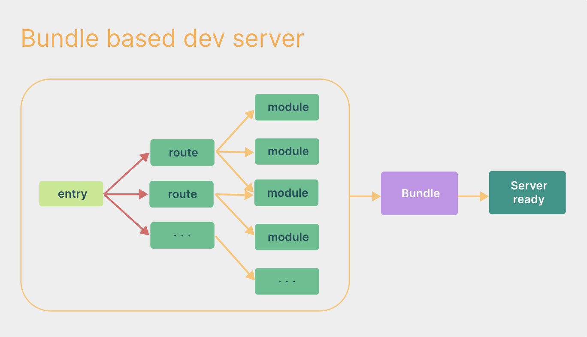
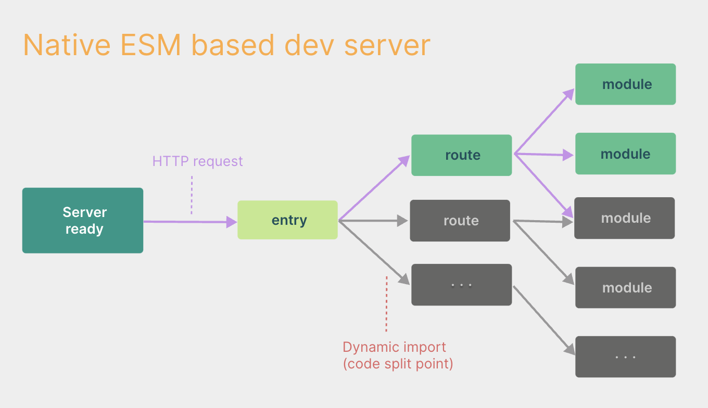

## 介绍

`Vite` 是一个前端构建工具

> 开发模式下借助浏览器对 ESM 的支持，采用 nobundle 的方式进行构建（esbuild 预构建依赖）。
> 生产模式下则基于 rollup 进行构建，需要打包

bundle方式（比如webpack）



unbundle方式



## 配置

`vue3 + vite + ts`

### 环境变量与模式

Vite 使用 dotenv 从你的 环境目录 中的下列文件加载额外的环境变量

```shell
.env                # 所有情况下都会加载
.env.local          # 所有情况下都会加载，但会被 git 忽略
.env.[mode]         # 只在指定模式下加载
.env.[mode].local   # 只在指定模式下加载，但会被 git 忽略
```

加载的环境变量也会通过 `import.meta.env` 以字符串形式暴露给客户端源码。

为了防止意外地将一些环境变量泄漏到客户端，只有以 `VITE_` 为前缀的变量才会暴露给经过 vite 处理的代码。例如下面这些环境变量

```shell
VITE_SOME_KEY=123
DB_PASSWORD=foobar
```

只有 `VITE_SOME_KEY` 会被暴露为 `import.meta.env.VITE_SOME_KEY` 提供给客户端源码，而 `DB_PASSWORD` 则不会。

```shell
console.log(import.meta.env.VITE_SOME_KEY) // 123
console.log(import.meta.env.DB_PASSWORD) // undefined
```

.env.development (开发环境变量)

```shell
# 请勿改动这一项，该项也不可以通过 import.meta.env.NODE_ENV 调用
NODE_ENV = development

# 下面是自定义的环境变量，可以修改（命名必须以 VITE_ 开头）

## 后端接口公共路径（如果解决跨域问题采用反向代理就只需写公共路径）
VITE_BASE_API = '/api'

## 前端端口
VITE_CLI_PORT = 8080

## 后端地址
VITE_BASE_PATH = http://127.0.0.1

## 后端端口
VITE_SERVER_PORT = 8888

## 路由模式 hash 或 html5
VITE_ROUTER_HISTORY = 'hash'

## 开发环境地址前缀（一般 '/'，'./' 都可以）
VITE_PUBLIC_PATH = '/'
```

.env.production (生产环境变量)

```shell
# 请勿改动这一项，该项也不可以通过 import.meta.env.NODE_ENV 调用
NODE_ENV = production

# 下面是自定义的环境变量，可以修改（命名必须以 VITE_ 开头）

## 后端接口公共路径（如果解决跨域问题采用 CORS 就需要写全路径）
VITE_BASE_API = '/api'

## 路由模式 hash 或 html5
VITE_ROUTER_HISTORY = 'hash'

## 打包路径
VITE_PUBLIC_PATH = '/'
```

**TypeScript 的智能提示**

.env.d.ts (ts)

```ts
/// <reference types="vite/client" />

/** 声明 vite 环境变量的类型（如果未声明则默认是 any） */
declare interface ImportMetaEnv {
  readonly VITE_BASE_API: string
  readonly VITE_CLI_PORT: number
  readonly VITE_BASE_PATH: string
  readonly VITE_SERVER_PORT: number
  readonly VITE_ROUTER_HISTORY: "hash" | "html5"
  readonly VITE_PUBLIC_PATH: string
}
```

### 配置文件

vite.config.ts

```ts
import { type ConfigEnv, type UserConfigExport, loadEnv } from "vite"
import path, { resolve } from "path"
import vue from "@vitejs/plugin-vue"
import DefineOptions from "unplugin-vue-define-options/vite"

/** 配置项文档：https://cn.vitejs.dev/config */
export default (configEnv: ConfigEnv): UserConfigExport => {
  const viteEnv = loadEnv(configEnv.mode, process.cwd()) as ImportMetaEnv
  const { VITE_PUBLIC_PATH, VITE_CLI_PORT, VITE_BASE_API, VITE_BASE_PATH, VITE_SERVER_PORT } = viteEnv
  return {
    /** 打包时根据实际情况修改 base */
    base: VITE_PUBLIC_PATH,
    resolve: {
      alias: {
        /** @ 符号指向 src 目录 */
        "@": resolve(__dirname, "./src")
      }
    },
    server: {
      /** 是否开启 HTTPS */
      https: false,
      /** 设置 host: true 才可以使用 Network 的形式，以 IP 访问项目 */
      host: true, // host: "0.0.0.0"
      /** 端口号 */
      port: VITE_CLI_PORT,
      /** 是否自动打开浏览器 */
      open: true,
      /** 跨域设置允许 */
      cors: true,
      /** 端口被占用时，是否直接退出 */
      strictPort: false,
      /** 接口代理 */
      proxy: {
        [VITE_BASE_API]: {
          target: `${VITE_BASE_PATH}:${VITE_SERVER_PORT}/`, // "http://127.0.0.1:8888/",
          /** 是否允许跨域 */
          changeOrigin: true,
          rewrite: (path) => path.replace(VITE_BASE_API, "")
        }
      }
    },
    build: {
      /** 消除打包大小超过 500kb 警告 */
      chunkSizeWarningLimit: 2000,
      /** Vite 2.6.x 以上需要配置 minify: "terser", terserOptions 才能生效 */
      minify: "terser",
      /** 在打包代码时移除 console.log、debugger 和 注释 */
      terserOptions: {
        compress: {
          drop_console: false,
          drop_debugger: true,
          pure_funcs: ["console.log"]
        },
        format: {
          /** 删除注释 */
          comments: false
        }
      },
      /** 打包后静态资源目录 */
      assetsDir: "static"
    },
    /** Vite 插件 */
    plugins: [
      vue(),
      /** DefineOptions 可以更简单的注册组件名称 */
      DefineOptions()
    ]
  }
}
```
