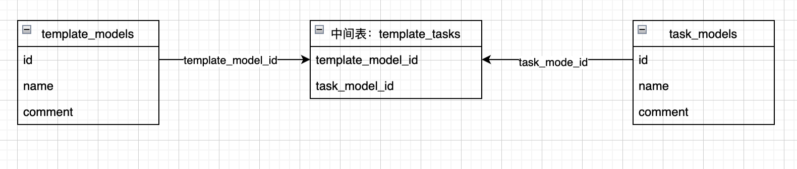

## 入门指南

### 声明模型

```go
type Cluster struct {
  global.ARSDN_MODEL
  Name         string      `gorm:"not null;unique;comment:'集群名称'"`
  CType        string      `gorm:"type:enum('master','slave');default:'master';comment:'主从类型'"`
  MasterIp     string      `gorm:"comment:'主集群IP'"`
  MasterPort   uint        `gorm:"comment:'主集群Port'"`
  MasterPass   string      `gorm:"type:varchar(2000);comment:'主集群密码'"`
  Desc         string      `gorm:"comment:'集群描述'"`
  SdnVersion   string      `gorm:"type:enum('arSdn_3.1', 'arSdn_3.2');comment:'SDN版本'"`
  BackendType  string      `gorm:"type:enum('KVM','VMware');comment:'后端集群类型'"`
  BackendIp    string      `gorm:"not null;unique;comment:'后端集群IP'"`
  BackendPort  uint        `gorm:"not null;comment:'后端集群端口'"`
  BackendUser  string      `gorm:"comment:'VMware账号'"`
  BackendPass  string      `gorm:"comment:'VMware密码'"`
  Network      Networks    `gorm:"not null;type:json;comment:'网络'"`
  Sdn          SDN         `gorm:"not null;type:json;comment:'SDN参数'"`
  Status       int         `gorm:"not null;comment:'集群状态'"`
  Hosts        []HostModel `gorm:"constraint:OnDelete:CASCADE;comment:'主机'"`
}
```

`Networks`、`SDN`是自定义数据类型，详情见自定义数据类型章节

对应MySQL中的类型

```shell
mysql> desc clusters;
+----------------+------------------------+------+-----+---------+----------------+
| Field          | Type                   | Null | Key | Default | Extra          |
+----------------+------------------------+------+-----+---------+----------------+
| id             | bigint unsigned        | NO   | PRI | NULL    | auto_increment |
| created_at     | datetime               | YES  |     | NULL    |                |
| updated_at     | datetime               | YES  |     | NULL    |                |
| deleted_at     | datetime               | YES  | MUL | NULL    |                |
| name           | varchar(191)           | NO   | UNI | NULL    |                |
| c_type         | enum('master','slave') | YES  |     | master  |                |
| master_ip      | varchar(191)           | YES  |     | NULL    |                |
| master_port    | bigint unsigned        | YES  |     | NULL    |                |
| master_pass    | varchar(2000)          | YES  |     | NULL    |                |
| desc           | varchar(191)           | YES  |     | NULL    |                |
| sdn_version    | enum('arSdn_3.1')      | YES  |     | NULL    |                |
| backend_type   | enum('KVM','VMware')   | YES  |     | NULL    |                |
| backend_ip     | varchar(191)           | NO   | UNI | NULL    |                |
| backend_port   | bigint unsigned        | NO   |     | NULL    |                |
| backend_user   | varchar(191)           | YES  |     | NULL    |                |
| backend_pass   | varchar(191)           | YES  |     | NULL    |                |
| network        | json                   | NO   |     | NULL    |                |
| sdn            | json                   | NO   |     | NULL    |                |
| status         | bigint                 | NO   |     | NULL    |                |
| latest_task_id | varchar(191)           | YES  |     | NULL    |                |
+----------------+------------------------+------+-----+---------+----------------+
```

#### 字段标签

| 标签名 | 说明 |
| ----- | --- |
| column | 指定 db 列名 |
| type | 列数据类型，type:enum('KVM','VMware')|

### 连接到数据库

GORM 官方支持的数据库类型有：MySQL, PostgreSQL, SQlite, SQL Server

#### MySQL

```go
import (
  "gorm.io/driver/mysql"
  "gorm.io/gorm"
)

// 不建立外键
func gormConfig() *gorm.Config {
  config := &gorm.Config{DisableForeignKeyConstraintWhenMigrating: true}
  return config
}

func GormMysql() *gorm.DB {
  dsn := "root:huayun2021@tcp(127.0.0.1:3306)/dbname?charset=utf8mb4&parseTime=True&loc=Local"
  mysqlConfig := mysql.Config{
    DSN:                       dsn,   // DSN data source name
    DefaultStringSize:         256,   // string 类型字段的默认长度
    DisableDatetimePrecision:  true,  // 禁用 datetime 精度，MySQL 5.6 之前的数据库不支持
    DontSupportRenameIndex:    true,  // 重命名索引时采用删除并新建的方式，MySQL 5.7 之前的数据库和 MariaDB 不支持重命名索引
    DontSupportRenameColumn:   true,  // 用 `change` 重命名列，MySQL 8 之前的数据库和 MariaDB 不支持重命名列
    SkipInitializeWithVersion: false, // 根据版本自动配置
  }
  if db, err := gorm.Open(mysql.New(mysqlConfig), gormConfig()); err != nil {
    log.Println("mysql connect fail")
    return nil
  } else {
    return db
  }
}
```

## CRUD

### 创建

```go
user := User{Name: "pdd", Age: 18, Birthday: time.Now()}

result := db.Create(&user) // 通过数据的指针来创建

user.ID             // 返回插入数据的主键
result.Error        // 返回 error
result.RowsAffected // 返回插入记录的条数
```

#### 批量插入

要有效地插入大量记录，请将一个 slice 传递给 Create 方法。 GORM 将生成单独一条SQL语句来插入所有数据，并回填主键的值，钩子方法也会被调用。

```go
var users = []User{{Name: "jinzhu1"}, {Name: "jinzhu2"}, {Name: "jinzhu3"}}
db.Create(&users)

for _, user := range users {
  user.ID // 1,2,3
}
```

使用`CreateInBatches`分批创建时，你可以指定每批的数量，例如：

```go
var users = []User{{name: "pdd_1"}, ...., {Name: "pdd_10000"}}

// 数量为 100
db.CreateInBatches(users, 100)
```

#### upsert(update+insert) 冲突

表cluster, 表host 一对多关联

```go
model cluster {
  hosts []host
}
```

```go
model host {
  ssh_ip string `gorm:not null;unique`
}
```

cluster.hosts = []host

gorm.db.create(&cluster)

实际执行的SQL语句

```sql
insert into host ... ON DUPLICATE KEY UPDATE `cluster_id`=VALUES(`cluster_id`)
insert into cluster ...
```

***目前问题***

创建集群的时候会更新主机

主机（192.168.1.1, 192.168.1.2） 属于集群1

创建集群2（主机ssh_ip也是192.168.1.1, 192.168.1.2）

创建成功

192.168.1.1, 192.168.1.2 属于集群2

集群1无对应主机

解决方案

事务 create db host、create cluster 分开执行

### 查询

- 检索单个对象

GORM 提供了`First`、`Take`、`Last`方法，以便从数据库中检索单个对象。当查询数据库时它添加了`LIMIT 1`条件，且没有找到记录时，它会返回`ErrRecordNotFound`错误

```go
// 获取第一条记录（主键升序）
db.First(&user)
// SELECT * FROM users ORDER BY id LIMIT 1;

// 获取一条记录，没有指定排序字段
db.Take(&user)
// SELECT * FROM users LIMIT 1;

// 获取最后一条记录（主键降序）
db.Last(&user)
// SELECT * FROM users ORDER BY id DESC LIMIT 1;

result := db.First(&user)
result.RowsAffected // 返回找到的记录数
result.Error        // returns error or nil

// 检查 ErrRecordNotFound 错误
errors.Is(result.Error, gorm.ErrRecordNotFound)
```

- 检索全部对象

```go
// 获取全部记录
var users []User
result := db.Find(&users)
// SELECT * FROM users;

result.RowsAffected // 返回找到的记录数，相当于 `len(users)`
result.Error        // returns error
```

### 更新

```go
db.Model(&Email{}).Where("id = ?", 2).Update("email", "plsof@qq.com")
```

### 删除

删除一条记录时，删除对象需要指定主键，否则会触发 **批量 Delete**

```go
// Email 的 ID 是 `10`
db.Delete(&email)
// DELETE from emails where id = 10;

// 带额外条件的删除
db.Where("name = ?", "pdd").Delete(&email)
// DELETE from emails where id = 10 AND name = "pdd";
```

#### 根据主键删除

GORM 允许通过主键(可以是复合主键)和内联条件来删除对象，它可以使用数字

```go
db.Delete(&User{}, 10)
// DELETE FROM users WHERE id = 10;

db.Delete(&User{}, "10")
// DELETE FROM users WHERE id = 10;

db.Delete(&users, []int{1,2,3})
// DELETE FROM users WHERE id IN (1,2,3);
```

#### 批量删除

GORM默认不允许批量删除，对此你必须加一些条件，或者使用原生SQL，或者启用 `AllowGlobalUpdate` 模式

```go
db.Delete(&User{}).Error // gorm.ErrMissingWhereClause

db.Where("1 = 1").Delete(&User{})
// DELETE FROM `users` WHERE 1=1

db.Exec("DELETE FROM users")
// DELETE FROM users

db.Session(&gorm.Session{AllowGlobalUpdate: true}).Delete(&User{})
// DELETE FROM users
```

#### 软删除

如果你的模型里面包含`gorm.DeleteAt`（`gorm.Model`提供）字段，会执行软删除。

记录不会被删除，而是把`DeleteAt`字段设置为当前时间，Query请求的时候不会显示出这个字段。

`Unscoped`会执行物理的删除

```go
db.Unscoped().Delete(&order)
// DELETE FROM orders WHERE id=10;
```

#### 阻止全局删除

如果在没有任何条件的情况下执行批量删除，GORM 不会执行该操作，并返回 ErrMissingWhereClause 错误

对此，你必须加一些条件，或者使用原生 SQL，或者启用 AllowGlobalUpdate 模式，例如：

```go
db.Delete(&User{}).Error // gorm.ErrMissingWhereClause

db.Where("1 = 1").Delete(&User{})
// DELETE FROM `users` WHERE 1=1

db.Exec("DELETE FROM users")
// DELETE FROM users

db.Session(&gorm.Session{AllowGlobalUpdate: true}).Delete(&User{})
// DELETE FROM users
```

## 关联

### Belongs to

`belongs to`会与另一个模型建立了一对一的连接。这种模型的每一个实例都“属于”另一个模型的一个实例。

例如，您的应用包含 cluster 和 host，并且每个 host 能且只能被分配给一个 cluster。下面的类型就表示这种关系。注意，在`Host`对象中，有一个和`Cluster`一样的ClusterID。默认情况下，`ClusterID`被隐含地用来在`Host`和`Cluster`之间创建一个外键关系，因此必须包含在`Host`结构体中才能填充`Cluster`内部结构体。

```go
// Host 属于 Cluster，ClusterID是外键
type Host struct {
  gorm.Model
  HostName  string  `gorm:"column:hostname;not null;unique"`
  SshIp     string  `gorm:"not null;unique"`
  ClusterID uint    // 外键
  Cluster   Cluster
}

type Cluster struct {
  gorm.Model
  Name  string  `gorm:"not null;unique"`
}
```

### Has One

`has one`与另一个模型建立一对一的关联，但它和一对一关系有些许不同。这种关联表明一个模型的每个实例都包含或拥有另一个模型的一个实例。

例如，您的应用包含 cluster 和 host 模型，且每个 cluster 只能有一个 host。

```go
// Cluster有一个Host，ClusterID是外键
type Cluster struct {
  gorm.Model
  Name  string  `gorm:"not null;unique"`
  Host  Host    `gorm:"constraint:OnDelete:CASCADE"`
}

type Host struct {
  gorm.Model
  ClusterID uint    // 外键
  HostName  string  `gorm:"column:hostname;not null;unique"`
  SshIp     string  `gorm:"not null;unique"`
}
```

### Has Many

`has many`与另一个模型建立了一对多的连接。不同于`has one`，拥有者可以有零或多个关联模型。

例如，您的应用包含cluster和host模型，且每个cluster可以有多个host。

```go
// Cluster有多个Host，ClusterID是外键
type Cluster struct {
  gorm.Model
  Name  string  `gorm:"not null;unique"`
  Hosts []Host  `gorm:"constraint:OnDelete:CASCADE"`
}

type Host struct {
  gorm.Model
  ClusterID uint    // 外键
  HostName  string  `gorm:"column:hostname;not null;unique"`
  SshIp     string  `gorm:"not null;unique"`
}
```

### Many To Many

多对多会在两张表之间添加一张连接表

例如：模板表、任务表，模板表的每条记录包含多条任务。与一对多的区别：**一对多中每条记录含有的多条记录必须是唯一的，不能被其它记录包含了**



```go
package main

import (
  "gorm.io/driver/mysql"
  "gorm.io/gorm"
  "time"
)

type CommonMODEL struct {
  ID        uint           `gorm:"primarykey"` // 主键ID
  CreatedAt time.Time      // 创建时间
  UpdatedAt time.Time      // 更新时间
  DeletedAt gorm.DeletedAt `gorm:"index" json:"-"` // 删除时间
}

// 模板表
type TemplateModel struct {
  CommonMODEL
  Name    string      `json:"name" gorm:"not null;unique"`
  Tasks   []TaskModel `json:"tasks" gorm:"many2many:template_tasks"`
  Comment string      `json:"comment"`
}

// 任务表
type TaskModel struct {
  CommonMODEL
  Name    string `json:"name" gorm:"not null;unique"`
  Comment string `json:"comment"`
}

func main() {
  client, err := gorm.Open(mysql.Open("root:huayun2021@(127.0.0.1)/gorm?charset=utf8mb4&parseTime=True&loc=Local"),
    &gorm.Config{DisableForeignKeyConstraintWhenMigrating: true})
  if err != nil {
    panic(err)
  }
  db, _ := client.DB()
  defer db.Close()

  // 初始化表
  client.AutoMigrate(&TemplateModel{}, &TaskModel{})

  var task1, task2, task3 TaskModel
  task1.ID = 1
  task1.Name = "task1"
  task2.ID = 2
  task2.Name = "task2"
  task3.ID = 3
  task3.Name = "task3"

  var template1, template2 TemplateModel
  template1.Name = "template1"
  template2.Name = "template2"

  tTasks1 := make([]TaskModel, 2)
  tTasks1[0] = task1
  tTasks1[1] = task2
  template1.Tasks = tTasks1

  tTasks2 := make([]TaskModel, 3)
  tTasks2[0] = task1
  tTasks2[1] = task2
  tTasks2[2] = task3
  template2.Tasks = tTasks2

  // 创建任务
  client.Create(&task1)
  client.Create(&task2)
  client.Create(&task3)

  // 创建模板
  client.Create(&template1)
  client.Create(&template2)
}
```

验证

```shell
mysql> select * from task_models;
+----+-------------------------+-------------------------+------------+-------+---------+
| id | created_at              | updated_at              | deleted_at | name  | comment |
+----+-------------------------+-------------------------+------------+-------+---------+
|  1 | 2022-07-09 15:47:05.219 | 2022-07-09 15:47:05.219 | NULL       | task1 |         |
|  2 | 2022-07-09 15:47:05.228 | 2022-07-09 15:47:05.228 | NULL       | task2 |         |
|  3 | 2022-07-09 15:47:05.236 | 2022-07-09 15:47:05.236 | NULL       | task3 |         |
+----+-------------------------+-------------------------+------------+-------+---------+
3 rows in set (0.00 sec)

mysql> select * from template_models;
+----+-------------------------+-------------------------+------------+-----------+---------+
| id | created_at              | updated_at              | deleted_at | name      | comment |
+----+-------------------------+-------------------------+------------+-----------+---------+
|  1 | 2022-07-09 15:47:05.242 | 2022-07-09 15:47:05.242 | NULL       | template1 |         |
|  2 | 2022-07-09 15:47:05.279 | 2022-07-09 15:47:05.279 | NULL       | template2 |         |
+----+-------------------------+-------------------------+------------+-----------+---------+
2 rows in set (0.00 sec)

mysql> select * from template_tasks;
+-------------------+---------------+
| template_model_id | task_model_id |
+-------------------+---------------+
|                 1 |             1 |
|                 1 |             2 |
|                 2 |             1 |
|                 2 |             2 |
|                 2 |             3 |
+-------------------+---------------+
5 rows in set (0.01 sec)
```

### 关联模式

#### 查找关联

查找template ID为1包含的所有任务

```go
var tasks []TaskModel
var template TemplateModel
template.ID = 1
client.Model(&template).Association("Tasks").Find(&tasks)

for _, t := range tasks {
  fmt.Println(t.Name)
}

name -> task1
name -> task2
```

#### 添加关联

template ID为1的记录添加任务3

```go
var task TaskModel
task.ID = 3
var template TemplateModel
template.ID = 1
client.Model(&template).Association("Tasks").Append(&task)
```

#### 替换关联

template ID为1的记录目前的任务为1、2、3，现替换为4

```go
var task TaskModel
task.ID = 4
task.Name = "task4"
var template TemplateModel
template.ID = 1
client.Model(&template).Association("Tasks").Replace(&task)
```

### 预加载

GORM 允许在 Preload 的其它 SQL 中直接加载关系，例如：

```go
// Cluster有多个Host，ClusterID是外键
type Cluster struct {
  gorm.Model
  Name  string  `gorm:"not null;unique"`
  Hosts []Host  `gorm:"constraint:OnDelete:CASCADE"`
}

type Host struct {
  gorm.Model
  ClusterID uint    // 外键
  HostName  string  `gorm:"column:hostname;not null;unique"`
  SshIp     string  `gorm:"not null;unique"`
}

// 查找 cluster 时预加载相关 host
db.Preload("Hosts").Find(&cluster)
// SELECT * FROM clusters;
// SELECT * FROM hosts WHERE cluster_id = 1;
```

## 自定义数据类型

GORM 提供了少量接口，使用户能够为 GORM 定义支持的数据类型

### Scanner/Valuer

自定义的数据类型必须实现`Scanner`和`Valuer`接口，以便让 GORM 知道如何将该类型接收、保存到数据库

```go
// 网络
{
  "network": {
    "internal_network": {
      "net_start": "192.168.1.1",
      "net_end": "192.168.1.10",
      "prefix": 24
    },
    "management_network": {
      "net_start": "192.168.1.1",
      "net_end": "192.168.1.10",
      "prefix": 24
    },
  }
}

type Networks map[string]map[string]string

func (c Networks) Value() (driver.Value, error) {
  b, err := json.Marshal(c)
  return string(b), err
}

func (c *Networks) Scan(input interface{}) error {
  return json.Unmarshal(input.([]byte), c)
}

// SDN
{
  internal_vlan_id: "",
  external_vlan_range: "",
  vroute_template: "",
  mirror_url: "",
  mirror_tag: "",
  arnet_vlan_range: "",
}

type SDN map[string]string

func (c SDN) Value() (driver.Value, error) {
  b, err := json.Marshal(c)
  return string(b), err
}

func (c *SDN) Scan(input interface{}) error {
  return json.Unmarshal(input.([]byte), c)
}

type Cluster struct {
  global.ARSDN_MODEL
  Name         string      `gorm:"not null;unique;comment:'集群名称'"`
  CType        string      `gorm:"type:enum('master','slave');default:'master';comment:'主从类型'"`
  MasterIp     string      `gorm:"comment:'主集群IP'"`
  MasterPort   uint        `gorm:"comment:'主集群Port'"`
  MasterPass   string      `gorm:"type:varchar(2000);comment:'主集群密码'"`
  Desc         string      `gorm:"comment:'集群描述'"`
  SdnVersion   string      `gorm:"type:enum('arSdn_3.1', 'arSdn_3.2');comment:'SDN版本'"`
  BackendType  string      `gorm:"type:enum('KVM','VMware');comment:'后端集群类型'"`
  BackendIp    string      `gorm:"not null;unique;comment:'后端集群IP'"`
  BackendPort  uint        `gorm:"not null;comment:'后端集群端口'"`
  BackendUser  string      `gorm:"comment:'VMware账号'"`
  BackendPass  string      `gorm:"comment:'VMware密码'"`
  Network      Networks    `gorm:"not null;type:json;comment:'网络'"`
  Sdn          SDN         `gorm:"not null;type:json;comment:'SDN参数'"`
  Status       int         `gorm:"not null;comment:'集群状态'"`
  Hosts        []HostModel `gorm:"constraint:OnDelete:CASCADE;comment:'主机'"`
}
```
